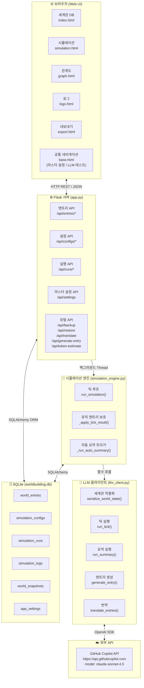
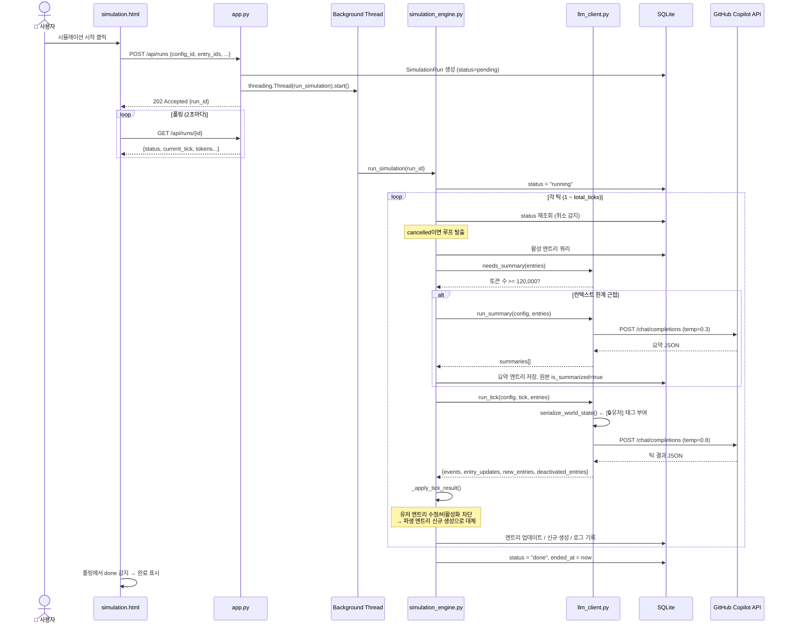
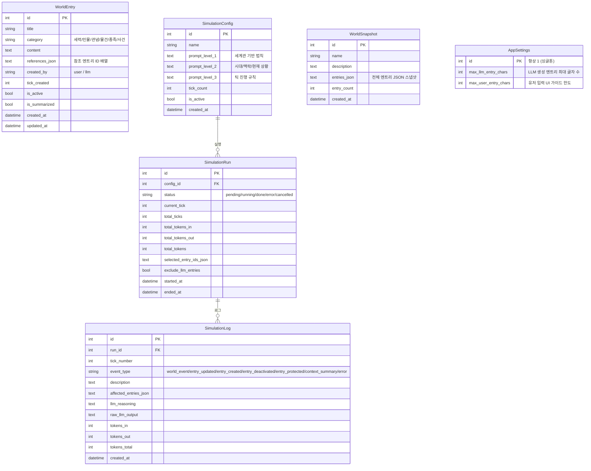
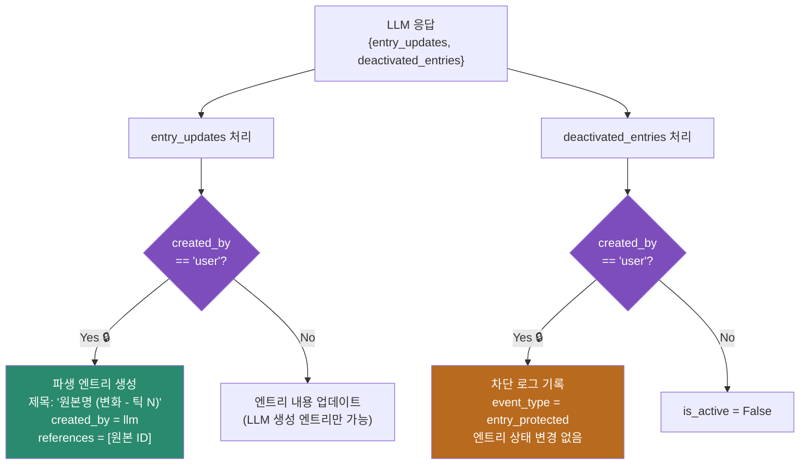
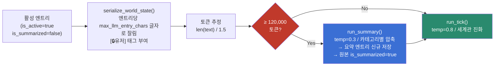

# WorldLLM 시스템 아키텍처

> 본 문서는 WorldLLM의 전체 구조, 데이터 흐름, 구성 요소 간 관계를 도식화한다.
> GitHub에서 Mermaid 다이어그램이 자동 렌더링된다.

---

## 1. 전체 시스템 구성도



---

## 2. 틱 실행 흐름 (Sequence Diagram)



---

## 3. 데이터 모델 (ER Diagram)



---

## 4. 유저 엔트리 보호 흐름



---

## 5. 컨텍스트 관리 전략



---

## 6. 시스템 동작 안내

### 기본 사용 흐름

```
1. 세계관 DB  →  엔트리 입력 (세력 / 인물 / 관념 / 물건 / 종족 / 사건)
                  └─ LLM 생성 버튼으로 내용 자동 작성 가능

2. 시뮬레이션  →  설정 구성 (3-레벨 프롬프트 + 틱 수)
                  └─ 마스터 설정에서 LLM/유저 엔트리 글자 한도 설정

3. 시뮬레이션 시작  →  틱마다 LLM이 세계관 자율 진화
                       └─ 유저 엔트리는 보호됨 (수정/비활성화 불가)

4. 결과 확인  →  로그 / 관계도 / Export (JSON + CSV)
```

### 핵심 설계 원칙

| 원칙 | 구현 방식 |
|------|---------|
| **유저 세계관 코어 보호** | `[🔒유저]` 태그 + 코드 레벨 차단 |
| **LLM 생성과 유저 입력 구분** | `created_by: "user" / "llm"` 필드 |
| **컨텍스트 자동 관리** | 120k 토큰 초과 시 요약 압축 자동 실행 |
| **재현성 확보** | 모든 틱의 reasoning, raw 응답, 토큰 수 DB 저장 |
| **앱 재시작 안전성** | 시작 시 orphan 런 자동 cancelled 처리 |

### 주요 설정값

| 설정 | 위치 | 기본값 |
|------|------|--------|
| LLM 생성 엔트리 최대 글자 | 마스터 설정 (UI) | 500자 |
| 유저 입력 가이드 한도 | 마스터 설정 (UI) | 1,000자 |
| 자동 요약 임계값 | `llm_client.py` `CONTEXT_SUMMARY_THRESHOLD` | 120,000 토큰 |
| LLM 최대 출력 토큰 | `llm_client.py` `MAX_TOKENS` | 16,000 |
| 틱 창의성 (temperature) | `llm_client.py` `run_tick()` | 0.8 |

---

## 7. 로컬 LLM 전환 로드맵

현재 시스템은 GitHub Copilot API (claude-sonnet-4.5)를 사용하지만,
**OpenAI SDK 호환 인터페이스**로 추상화되어 있어 최소한의 수정으로 로컬 LLM으로 전환 가능하다.

### 현재 구조 (API)

```
llm_client.py
    └─ get_llm_client()
          └─ OpenAI(base_url="https://api.githubcopilot.com", api_key=GITHUB_TOKEN)
```

### 로컬 LLM 전환 시 변경 지점

`llm_client.py`의 `get_llm_client()` 함수 한 곳만 수정하면 된다.

```python
# 현재 (GitHub Copilot API)
client = OpenAI(
    base_url="https://api.githubcopilot.com",
    api_key=os.environ.get("GITHUB_TOKEN"),
    default_headers={ ... }
)

# 로컬 LLM 전환 예시 (Ollama / LM Studio / vLLM)
client = OpenAI(
    base_url="http://localhost:11434/v1",   # Ollama
    api_key="ollama",                        # 더미 키
)
```

### 로컬 LLM 후보 및 고려사항

| 서버 | 특징 | 적합 모델 예시 |
|------|------|--------------|
| **Ollama** | 설치 간편, macOS/Linux | llama3, mistral, gemma3 |
| **LM Studio** | GUI 제공, Windows 친화적 | 동일 |
| **vLLM** | 고성능, GPU 서버용 | Llama 3.1 70B+ |
| **llama.cpp** | 경량, CPU 가능 | GGUF 포맷 모델 |

### 로컬 전환 시 예상 이점

```
현재 (API)                          로컬 LLM
─────────────────────               ─────────────────────
context window: 200k                context window: 모델 의존 (8k ~ 128k)
비용: API 토큰 과금                  비용: 전기료 + 초기 하드웨어
틱 속도: 네트워크 지연 포함           틱 속도: GPU 성능에 비례
동시 실행: API Rate Limit            동시 실행: 하드웨어 한계까지 자유
데이터 프라이버시: 외부 전송           데이터 프라이버시: 완전 로컬
세계관 크기: API 토큰 비용 제약       세계관 크기: 사실상 무제한
```

### 대규모 로어 생성 전략 (로컬 전환 후)

로컬 LLM 환경에서는 다음 확장이 현실적으로 가능해진다.

1. **엔트리 수 제한 해제** — 현재 컨텍스트 압축 전략을 유지하되,
   더 많은 엔트리를 직렬화 단계에서 카테고리별 중요도 순으로 선별하는 로직 추가

2. **병렬 틱 실행** — 독립적인 지역/세력별 서브 세계관을 별도 스레드로 동시 시뮬레이션

3. **틱 간격 단축** — API Rate Limit 없이 연속 틱 가능 (틱 당 수초 단위)

4. **모델 역할 분리** — 틱 생성용 대형 모델 + 번역/요약용 소형 모델 혼용

5. **배치 처리** — 틱 결과를 즉시 DB 반영 대신 배치로 처리해 처리량 극대화

### 최소 전환 체크리스트

- [ ] 로컬 LLM 서버 설치 및 OpenAI 호환 API 활성화 확인
- [ ] `.env`에 `LLM_MODEL=모델명` 설정 (예: `llama3.2:latest`)
- [ ] `get_llm_client()` base_url / api_key 수정
- [ ] 모델의 실제 context window에 맞게 `CONTEXT_SUMMARY_THRESHOLD` 조정
- [ ] JSON 출력 안정성 확인 (로컬 모델은 JSON 준수율이 낮을 수 있음)
  - 필요 시 `_parse_json_safe()` 복구 로직 강화 또는 `format: json` 파라미터 추가

---

## 8. 파일 구조

```
worldllm/
├── app.py                    # Flask 서버, 라우트, API 엔드포인트
├── models.py                 # SQLAlchemy 모델 (6개 테이블)
├── llm_client.py             # LLM 통신, 프롬프트 템플릿, 직렬화
├── simulation_engine.py      # 틱 루프, 유저 엔트리 보호, 자동 요약
├── .env                      # GITHUB_TOKEN, LLM_MODEL, SECRET_KEY
├── instance/
│   └── worldbuilding.db      # SQLite 데이터베이스
├── templates/
│   ├── base.html             # 공통 레이아웃, 네비게이션, 마스터 설정 모달
│   ├── index.html            # 세계관 DB 관리 (CRUD, 멀티선택, LLM 생성)
│   ├── simulation.html       # 시뮬레이션 설정 및 실행 제어
│   ├── graph.html            # 엔트리 관계도 (vis.js Network)
│   ├── logs.html             # 틱 로그 뷰어
│   └── export.html           # 연구 데이터 내보내기 (JSON/CSV)
└── docs/
    ├── prompt_structure.md   # 프롬프트 구조 상세 문서
    └── system_architecture.md  # 본 문서
```
